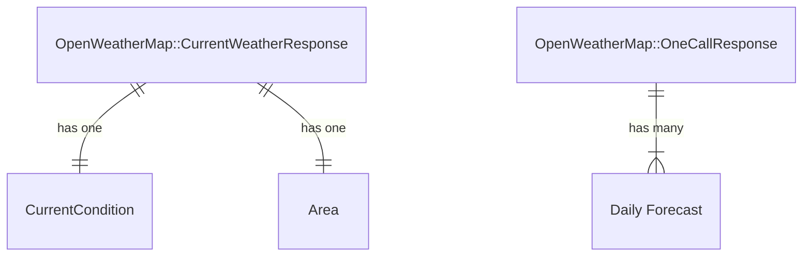
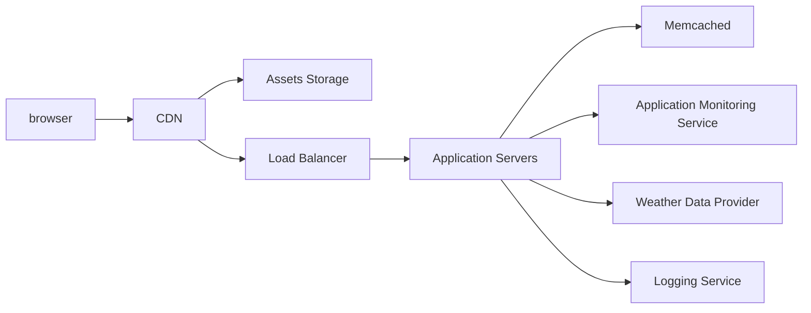

# README

## Weather Forecast.

This repository is a coding assignment.

##### Functional requirements

- Accept an address as input
- Forecast data is displayed for the given address
  - Current temp
  - Low/high
  - Extended forecast
- An indicator is shown when forecast data came from cache

##### Non-functional requirements

- Scale-able: must use caching strategies and other optimizations (eg: on queries) to scale for a real-world app.
  - Must include 30 minutes cache per zip code for forecast data.
- Must have UI
- Must have good tests
- Must have detailed documentation (in code and in this README). Complex entities are broken into sub-parts until the concepts are simple to understand.
- App must be robust and resilient for an enterprise grade production app
  - eg: throttling, network failures, API failures
- Must be clean, straightforward without being over-complicated.

## Approach

By building an API driven application, we avoid the need of managing state for all the possible locations. As user inputs and address, a geocoder service is used map an address to a zip code. Selecting an address redirects to the zip code's page where weather data is fetched and displayed.

#### Key services

- OpenWeather provides weather data via 2 APIs:
  1. [Current weather by ZIP](https://openweathermap.org/current#zip)
  2. [One Call API](https://openweathermap.org/api/one-call-3) for forecast
- MapBox [Geocoding API ](https://docs.mapbox.com/api/search/geocoding/) provides the location data. _This could be replaced by OpenWeather's [Geocoding API](https://openweathermap.org/api/geocoding-api) to reduce the number of data providers._

#### key entities

- **Area** is a geographical boundary by the US Postal Service.
- **Current Condition** is the observed weather.
- **Daily Forecast** is the weather prevision for a given day in the future.

#### Basic API

| Endpoint                                | Description                                       |
| --------------------------------------- | ------------------------------------------------- |
| GET /                                   | Returns search form                               |
| POST /geocode                           | Redirects to the ZIP code url                     |
| GET /us/zip/{zip_code}/weather-forecast | Returns current weather for a given ZIP code      |
| GET /:latitude/:longitude/forecast      | Returns the weather forecast for a given location |

#### Production Infrastructure

_A database is not yet needed at this stage._

## Design decisions & Trade-offs

**Delayed worldwide coverage**

Because few countries have ZIP code, caching by it would be impractical. New routes with another cache key would be needed. Due to the requirement of caching by ZIP, I did not explore solving this.

**Non-address locations**

The MapBox plug-in lists places that don't have address such as cities, regions, states or countries. Selecting one of those is not yet supported. Filtering the geocoding results would provide better UX for minimal effort.

With routes that are not limited by a ZIP code, we could improve the user experience by supporting weather for a city, district or neighborhood.

**ETag optimization**

Strict ETags are well suited for this app and would reduce the server load by removing the need for view rendering for requests with mathing Etags. To do so, the text for the cache indicator would be updated by a Stimulus controller to remain accurate.

# Development

### Getting setup

1. Install dependencies with `brew install memcached`
2. Install gems with `bundle install`
3. Get a copy of `config/master.key`. It should have been provided as a URL to a Gist.
4. Enable caching with `rails dev:cache`. Clearing it is done by running `Rails.cache.clear` in a Rails console.

### Server

Start the server with `bin/dev`. The application is available on Rails default URL [127.0.0.1:3000/](127.0.0.1:3000/).

### Testing

Run the tests with `rails test`
