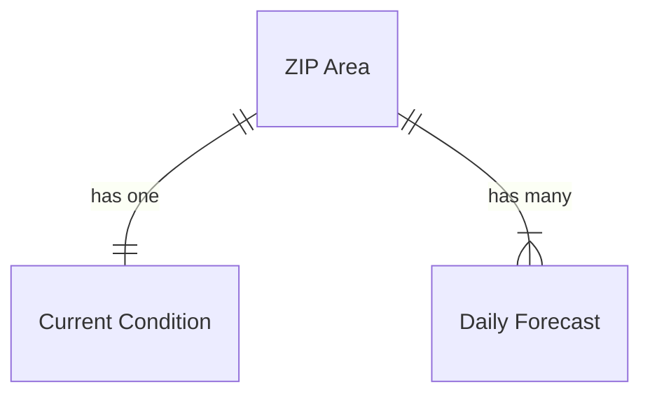
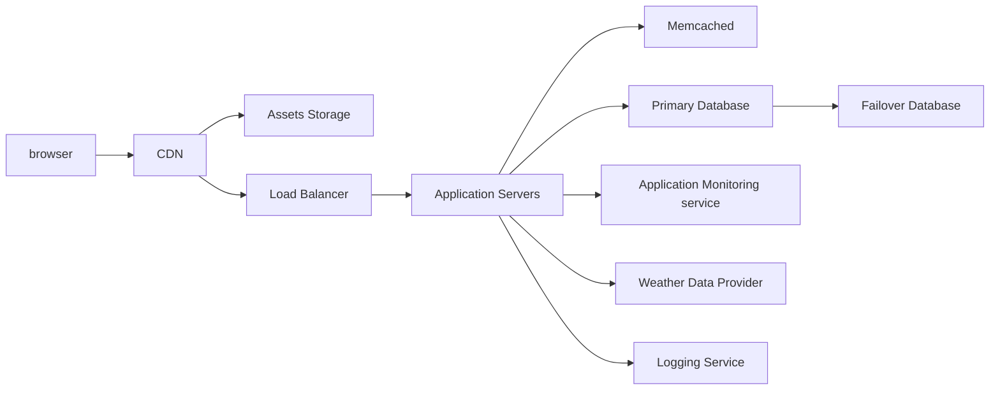

# README

Weather forecast is a conding assignment.

### Functional requirements

- Accept an address as input
- Forecast data is displayed for the given address
  - Current temp
  - Low/high
  - Extended forecast
- An indicator is shown when forecast data came from cache

### Non-functional requirements

- Scale-able: must use caching strategies and other optimizations (eg: on queries) to scale for a real-world app.
  - Must include 30 minutes cache per zip code for forecast data.
- Must have UI
- Must have good tests
- Must have detailed documentation (in code and in README files). Complex entities are broken into sub-parts until the concepts are simple to understand.
- App must be robust and resilient for an enterprise grade production app
  - Handle throttling
  - Handle network failures
  - Handle API failures
- Must be clean, straightforward without being over-complicated. Thus it must be easy to understand and follow.

## key entities

- The ZIP Code Area is a geographical boundary by the US Postal Service.
- Current condition is the observed weather.
- Daily Forecast is the forecast for a given day in the future.

## Basic API

| Endpoint                                | Description                                       |
| --------------------------------------- | ------------------------------------------------- |
| GET /                                   | Returns search form                               |
| GET /us/zip/{zip_code}/weather-forecast | Returns the weather forecast for a given ZIP code |

## Production Infrastructure

---

## Tasks

- [x] Generate blank Rails app with a database
- [x] Generate plain models
- [x] Display data (controller and views) by ZIP
- [x] Fetch API and load models with data
- [x] Extract API service with error handling
- [ ] Add Memcached
- [ ] Add a 30 min cache per ZIP
- [x] Add ability to input an address
- [x] Resolve the ZIP code from the address and redirect to its weather forecast
- [x] Add extended forecast
- [ ] Style the UI
- [ ] Update this readme for instalation instructions, design trade-offs and considerations.

# Design decisions & Trade-offs

- ***

---

This README would normally document whatever steps are necessary to get the
application up and running.

Things you may want to cover:

- Ruby version

- System dependencies

- Configuration

- Database creation

- Database initialization

- How to run the test suite

- Services (job queues, cache servers, search engines, etc.)

- Deployment instructions

- ...
